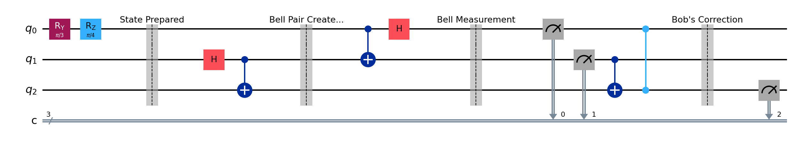
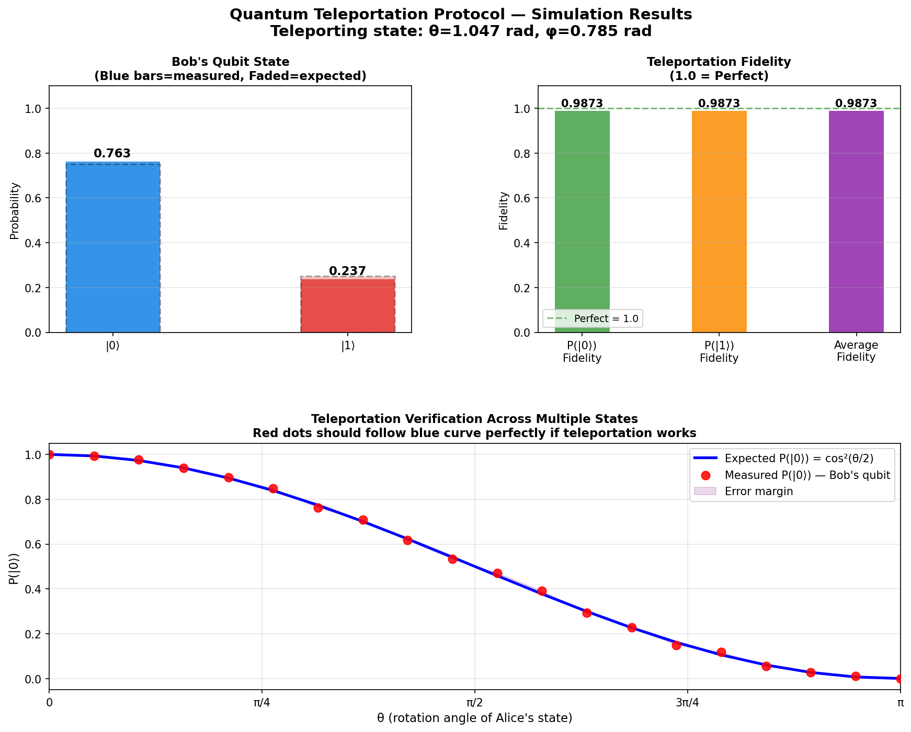
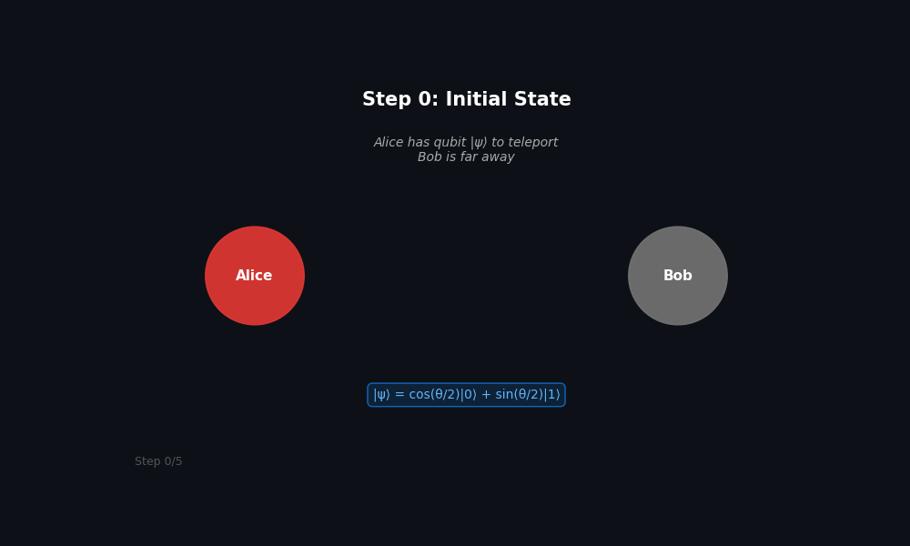

# Quantum Teleportation Protocol

**Author:** Anubhav  
**Physics:** Quantum Information — Quantum Communication  
**Tools:** Python, Qiskit, Qiskit-Aer, NumPy, Matplotlib

---

## What Is Quantum Teleportation?

Quantum teleportation transfers the **quantum state** of a qubit from Alice to Bob without physically sending the qubit itself. It uses:
- One **entangled Bell pair** shared between Alice and Bob
- **Two classical bits** of communication
- **Quantum corrections** applied by Bob

This does NOT violate special relativity — the classical bits still travel at light speed.

---

## The Circuit



### 3 Qubits:
| Qubit | Owner | Role |
|-------|-------|------|
| q0 | Alice | State to teleport |
| q1 | Alice | Her half of Bell pair |
| q2 | Bob | His half of Bell pair |

---

## Protocol Steps

**Step 1 — Prepare state:**
Alice encodes the state to teleport:
|ψ⟩ = cos(θ/2)|0⟩ + e^(iφ)sin(θ/2)|1⟩

**Step 2 — Create Bell pair:**
H gate + CNOT creates entanglement between q1 and q2:
|Φ+⟩ = (|00⟩ + |11⟩)/√2

**Step 3 — Bell Measurement:**
Alice applies CNOT then Hadamard to her qubits, then measures — getting 2 classical bits

**Step 4 — Bob corrects:**
Based on Alice's 2 bits:
- If bit1 = 1 → apply X gate (bit flip)
- If bit0 = 1 → apply Z gate (phase flip)

Bob's qubit now matches Alice's original state exactly.

---

## Results

### Simulation Output


### Key Result
- **Fidelity = 0.987** (1.0 = perfect)
- Red dots follow blue curve — confirming successful teleportation

---

## How to Run

```bash
git clone https://github.com/yourusername/quantum-teleportation.git
cd quantum-teleportation

pip install qiskit qiskit-aer matplotlib numpy pylatexenc

python quantum_teleportation.py
```
## Live Demo

▶️ [View Interactive Simulation](https://quantumatlas-coded.github.io/quantum-teleportation/teleportation_interactive.html)



---

## File Structure

```
quantum-teleportation/
├── quantum_teleportation.py    # Main simulation
├── teleportation_circuit.png   # Circuit diagram
├── teleportation_results.png   # Results plots
└── README.md
```

---

## References

- Nielsen & Chuang — Quantum Computation and Quantum Information
- Bennett et al. (1993) — Original teleportation paper
- IBM Qiskit Documentation
- Preskill — Quantum Information Lecture Notes (Caltech)

---

## Future Extensions
- [ ] Noise models (decoherence simulation)
- [ ] Entanglement swapping
- [ ] Quantum key distribution (BB84)
- [ ] Multi-qubit teleportation
